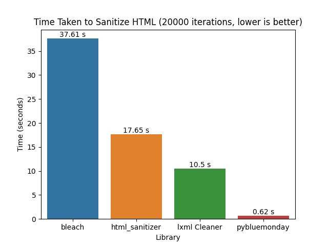

# pybluemonday

[](https://pypi.org/project/pybluemonday/)

pybluemonday is a library for sanitizing HTML very quickly via [bluemonday](https://github.com/microcosm-cc/bluemonday).

pybluemonday takes untrusted user generated content as an input, and will return HTML that has been sanitised against a whitelist of approved HTML elements and attributes so that you can safely include the content in your web page.

**Note**: This library is in a useable state but is still experimental. It may not have feature parity with the actual bluemonday and is likely to sanitize HTML slightly differently than other libraries. PRs and feedback are welcome on improving this library.

## Installation

```
pip install pybluemonday
```

## Examples

```python
from pybluemonday import UGCPolicy
s = UGCPolicy()

print(s.sanitize("<script>alert(1)</script><b class='stuff'>testing</b>"))
# <b>testing</b>

s.AllowAttrs("class", "style").Globally()
print(s.sanitize("<script>alert(1)</script><b class='stuff' style='color: red;'>testing</b>"))
# <b class="stuff" style="color: red;">testing</b>
```

```python
from pybluemonday import StrictPolicy
s = StrictPolicy()

s.sanitize("<center><b>Blog Post Title</b></center>")
# Blog Post Title
```

## How does this work?

pybluemonday is a binding to [bluemonday](https://github.com/microcosm-cc/bluemonday) through a shared library built through cgo. However, instead of replicating the entire API, pybluemonday uses reflection on the Go side and some type checking on the Python side to call the right bluemonday function when you try to call a method.

Essentially you want to create a Policy with the provided `pybluemonday.UGCPolicy`, `pybluemonday.StrictPolicy`, and `pybluemonday.NewPolicy` classes and then call methods that map to the appropriate [bluemonday struct method](https://pkg.go.dev/github.com/microcosm-cc/bluemonday#Policy).

This is an open area of improvement but gets reasonable coverage of the original bluemonday interface.

Also because it's difficult to share Go structs over to Python, pybluemonday keeps an ID reference to the struct in the Go side and passes the reference for every Go call. This means that if you corrupt or change the ID for some nonsensical reason you may likely end up with a memory leak. This is also an open area of improvement.

## Performance

Most Python based HTML sanitizing libraries will need to rely on [html5lib](https://html5lib.readthedocs.io/en/latest/) for parsing HTML in a reasoanble way. Because of this you will likely see performance hits when using these libraries.

Since pybluemonday is just bindings for [bluemonday](https://github.com/microcosm-cc/bluemonday) it has *very* good performance because all parsing and processing is done in Go by bluemonday. Go also ships an [HTML5 parser](https://godoc.org/golang.org/x/net/html) which means we avoid html5lib but still process HTML pretty well.

Always take benchmarks with a grain of salt but when compared to other similar Python sanitizing libraries pybluemonday executes far faster:



```
❯ python benchmarks.py
bleach (20000 sanitizations): 37.613802053
html_sanitizer (20000 sanitizations): 17.645683948
lxml Cleaner (20000 sanitizations): 10.500760227999997
pybluemonday (20000 sanitizations): 0.6188559669999876
```

Benchmarks taken on a MacBook Pro 15-inch, 2016 (2.7 GHz Intel Core i7, 16 GB RAM)
